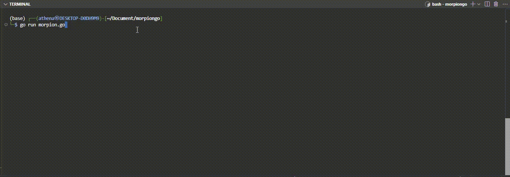

# MorpionGo


[](https://GitHub.com/thekester/morpiongo/releases/)

[](https://github.com/thekester/morpiongo/blob/main/LICENSE)


A simple Morpion (Tic-Tac-Toe) game written in Go.




## Description

This project is a basic implementation of the Morpion (Tic-Tac-Toe) game in the Go programming language. The goal of this project is to learn the fundamentals of Go while creating a playable terminal-based game. 

The code follows the structure and logic taught in the tutorials from [Devopssec](https://devopssec.fr), which provide detailed instructions on how to build a Morpion game step by step using Go.

## Getting Started

### Prerequisites

- [Go](https://golang.org/) version 1.16 or higher

### Installation

1. Clone the repository:

    ```bash
    git clone https://github.com/thekester/morpiongo.git
    cd morpiongo
    ```

2. Build the project:

    ```bash
    go build morpiongo.go
    ```

3. Run the game:

    ```bash
    ./morpiongo
    ```

## How to Play

- The game is a 2-player Tic-Tac-Toe (Morpion) game played in the terminal.
- Players take turns to enter their moves (row and column) to place their mark (`X` or `O`) on the grid.
- The first player to align 3 marks in a row, column, or diagonal wins the game.

## Learning Resources

This project was built by following these tutorials:

- [Learning Go Programming Language (Introduction)](https://devopssec.fr/article/cours-apprendre-langage-programmation-go#begin-article-section)
- [Hands-On Project: Morpion Game in Go](https://devopssec.fr/article/tp-jeu-du-morpions-golang#begin-article-section)

These resources provide an in-depth guide on Go programming and how to implement games like Morpion.

## Contributing

If you'd like to contribute to this project, feel free to fork the repository and submit pull requests.

## License

This project is licensed under the MIT License.
